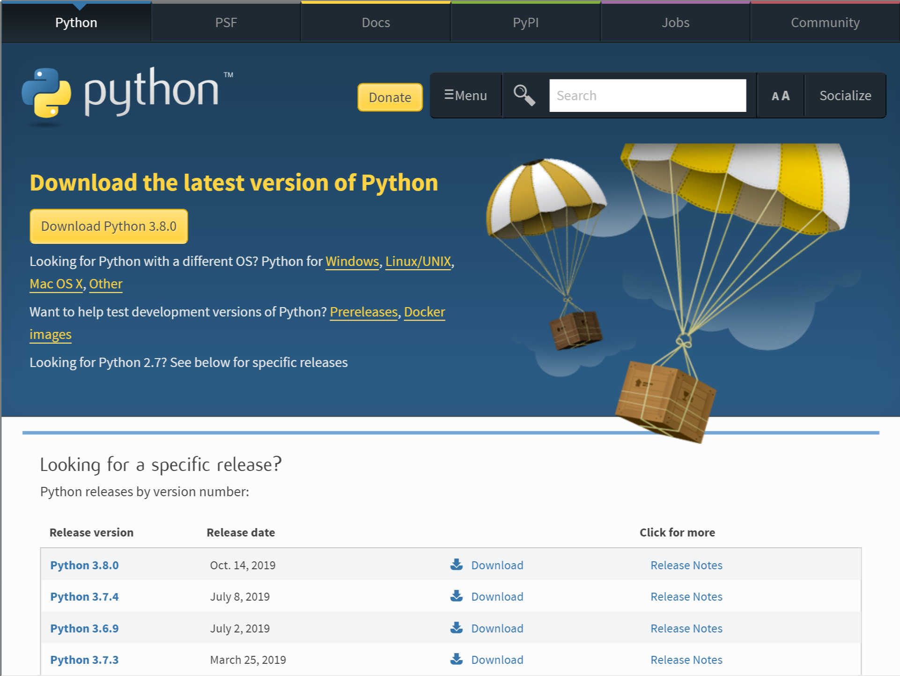
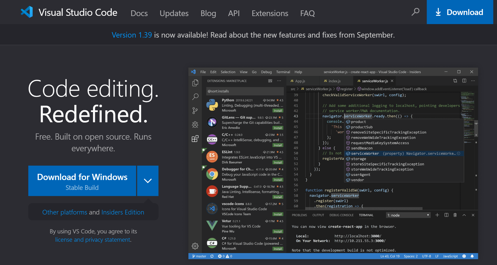

# Python Giành Cho Trẻ Em

## Giới Thiệu

### Tại sao chúng ta phải học lập trình?

Lập trình thúc đẩy sự sáng tạo, lý luận và giải quyết vấn đề. Lập trình viên có cơ hội để tạo ra thứ gì đó từ bắt đầu, sử dụng luận lý (logic) để biến các chỉ dẫn lập trình thành một hình thức mà máy tính có thể chạy, và khi mọi thứ không hoạt động như mong đợi, lập trình viên sẽ sử dụng kỹ năng giải quyết vấn đề để tìm ra cái gì đã sai.

Lập trình là một hoạt động thú vị, đôi khi đầy thách thức (và đôi khi gây nản lòng) và các kỹ năng học từ nó có thể hữu ích cả ở trường và tại nơi làm việc. . . thậm chí nếu sự nghiệp của bạn không có gì để làm với máy tính.
Và, nếu không có gì khác, lập trình là một cách tuyệt vời để vùi đầu vào trong một buổi chiều khi thời tiết bên ngoài ảm đạm.

### Tại sao chúng ta nên học Python

Python là ngôn ngữ lập trình dễ học, có một số các tính năng thực sự hữu ích cho một lập trình viên mới bắt đầu. Mã (Code) khá dễ đọc khi so sánh với các ngôn ngữ lập trình khác và chúng ta có thể sử dụng một trình soạn thảo lập trình (IDE) nhằm giúp tương tác để bạn có thể thấy chương trình của mình chạy. Ngoài cấu trúc ngôn ngữ đơn giản và IDE, Python có một số các tính năng làm tăng đáng kể quá trình học tập và cho phép bạn để kết hợp các hình ảnh động đơn giản để tạo trò chơi của riêng bạn.

Một là mô-đun rùa, lấy cảm hứng từ đồ họa Rùa (được sử dụng bởi Ngôn ngữ lập trình logo trở lại vào những năm 1960) và được thiết kế cho giáo dục. Một cái khác là mô-đun tkinter, một giao diện cho Bộ công cụ Tk GUI, cung cấp một cách đơn giản để tạo chương trình với đồ họa và hình ảnh động cao cấp hơn một chút.

### Cài đặt Python

Cài đặt Python khá đơn giản. Ở đây, chúng ta sẽ đi qua các bước để cài đặt nó trên Windows 7.
Khi cài đặt Python, bạn cũng sẽ thiết lập một đường link cho trình soạn thảo, đó là Môi trường DeveLopment tích hợp cho phép bạn viết chương trình cho Python.

Để cài đặt Python cho Microsoft Windows 7, hãy trỏ trình duyệt web tới https://www.python.org/downloads/ và tải xuống trình cài đặt Windows mới nhất cho Python 3. Tìm kiếm một phần trong menu có tiêu đề Liên kết nhanh, như được hiển thị ở đây:

### Cài đặt trình soạn thảo

Chúng ta sẽ sử dụng Visual Code để soạn thảo Python.
Liên kết sau để tải Visual Code [Visual Code](https://code.visualstudio.com/).

